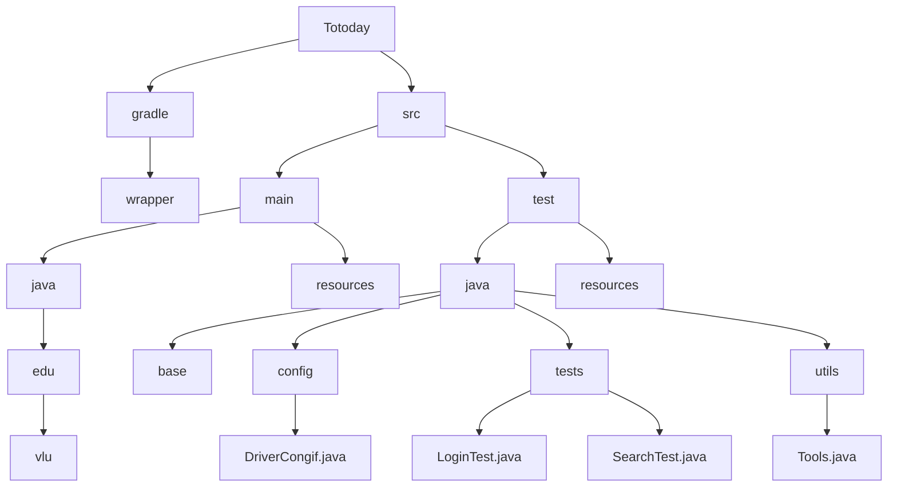

- root/
    - src/
        - main.py
        - utils.py
    - docs/
        - README.md
    - tests/
        - test_main.py
    - .gitignore
    - requirements.txt

```mermaid
graph TD;
    D[Totoday]
    D --> gradle;
    gradle --> wrapper;
    
    D --> src;
    src --> main;
    main --> java;
    java --> edu;
    edu --> vlu;
    main --> resources;
    
    src --> test;
    test --> java_test["java"];
    java_test --> base;
    java_test --> config;
    config --> DriverCongif.java
    java_test --> tests;
    tests --> LoginTest.java
    tests --> SearchTest.java
    java_test --> utils;
    utils --> Tools.java
    test --> resources_test["resources"];
```
