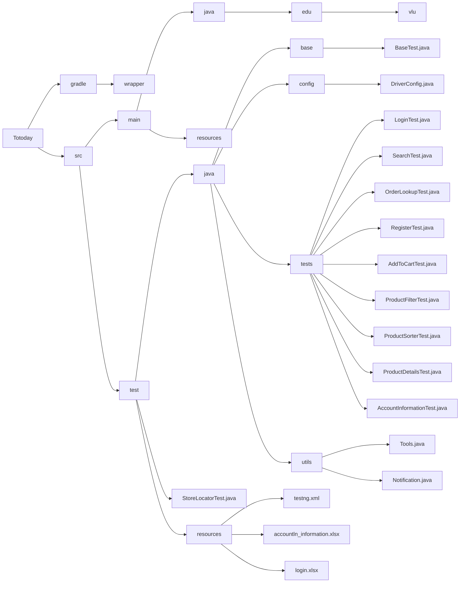

[//]: # ()
[//]: # (```mermaid)

[//]: # ()
[//]: # (graph TD)

[//]: # (    %% Build System)

[//]: # (    subgraph "Build System")

[//]: # (        BS1["build.gradle.kts"])

[//]: # (        BS2["gradlew"])

[//]: # (        BS3["gradlew.bat"])

[//]: # (        BS4["gradle/"])

[//]: # (    end)

[//]: # ()
[//]: # (    %% Core Application)

[//]: # (    subgraph "Core Application")

[//]: # (        CA1["Main Application"])

[//]: # (    end)

[//]: # ()
[//]: # (    %% Testing Suite)

[//]: # (    subgraph "Testing Suite")

[//]: # (        subgraph "Test Configuration")

[//]: # (            TC1["DriverConfig"])

[//]: # (        end)

[//]: # (        subgraph "Test Cases")

[//]: # (            TST1["LoginTest"])

[//]: # (            TST2["OrderLookupTest"])

[//]: # (            TST3["RegisterTest"])

[//]: # (            TST4["SearchTest"])

[//]: # (        end)

[//]: # (        subgraph "Test Utilities")

[//]: # (            TU1["Notification Utility"])

[//]: # (            TU2["Tools Utility"])

[//]: # (        end)

[//]: # (        TH1["Test Harness"])

[//]: # (    end)

[//]: # ()
[//]: # (    %% Connections between major components)

[//]: # (    BS1 -->|"builds"| CA1)

[//]: # (    BS1 -->|"orchestrates"| TH1)

[//]: # (    BS1 -->|"runs"| TC1)

[//]: # ()
[//]: # (    %% Test Cases interactions)

[//]: # (    TST1 -->|"uses"| TC1)

[//]: # (    TST2 -->|"uses"| TC1)

[//]: # (    TST3 -->|"uses"| TC1)

[//]: # (    TST4 -->|"uses"| TC1)

[//]: # ()
[//]: # (    %% Test Cases validating Core Application)

[//]: # (    TST1 -->|"tests"| CA1)

[//]: # (    TST2 -->|"tests"| CA1)

[//]: # (    TST3 -->|"tests"| CA1)

[//]: # (    TST4 -->|"tests"| CA1)

[//]: # ()
[//]: # (    %% Test Configuration loading utilities)

[//]: # (    TC1 -->|"loads"| TU1)

[//]: # (    TC1 -->|"loads"| TU2)

[//]: # ()
[//]: # (    %% Styling classes)

[//]: # (    classDef build fill:#ffd1dc,stroke:#ff69b4,stroke-width:2px;)

[//]: # (    classDef app fill:#d1ffd6,stroke:#32cd32,stroke-width:2px;)

[//]: # (    classDef config fill:#d1e0ff,stroke:#1e90ff,stroke-width:2px;)

[//]: # (    classDef test fill:#fff7d1,stroke:#ffcc00,stroke-width:2px;)

[//]: # (    classDef util fill:#f0d1ff,stroke:#8a2be2,stroke-width:2px;)

[//]: # (    classDef harness fill:#d1d1ff,stroke:#0000cd,stroke-width:2px;)

[//]: # ()
[//]: # (    %% Assign classes)

[//]: # (    class BS1,BS2,BS3,BS4 build;)

[//]: # (    class CA1 app;)

[//]: # (    class TC1 config;)

[//]: # (    class TST1,TST2,TST3,TST4 test;)

[//]: # (    class TU1,TU2 util;)

[//]: # (    class TH1 harness;)

[//]: # ()
[//]: # (    %% Click Events for Build System)

[//]: # (    click BS1 "https://github.com/shinki04/totodaywebtesting/blob/main/build.gradle.kts")

[//]: # (    click BS2 "https://github.com/shinki04/totodaywebtesting/tree/main/gradlew")

[//]: # (    click BS3 "https://github.com/shinki04/totodaywebtesting/blob/main/gradlew.bat")

[//]: # (    click BS4 "https://github.com/shinki04/totodaywebtesting/tree/main/gradle/")

[//]: # ()
[//]: # (    %% Click Event for Core Application)

[//]: # (    click CA1 "https://github.com/shinki04/totodaywebtesting/blob/main/src/main/java/edu/vlu/Main.java")

[//]: # ()
[//]: # (    %% Click Event for Test Configuration)

[//]: # (    click TC1 "https://github.com/shinki04/totodaywebtesting/blob/main/src/test/java/config/DriverConfig.java")

[//]: # ()
[//]: # (    %% Click Events for Test Cases)

[//]: # (    click TST1 "https://github.com/shinki04/totodaywebtesting/blob/main/src/test/java/tests/LoginTest.java")

[//]: # (    click TST2 "https://github.com/shinki04/totodaywebtesting/blob/main/src/test/java/tests/OrderLookupTest.java")

[//]: # (    click TST3 "https://github.com/shinki04/totodaywebtesting/blob/main/src/test/java/tests/RegisterTest.java")

[//]: # (    click TST4 "https://github.com/shinki04/totodaywebtesting/blob/main/src/test/java/tests/SearchTest.java")

[//]: # ()
[//]: # (    %% Click Events for Test Utilities)

[//]: # (    click TU1 "https://github.com/shinki04/totodaywebtesting/blob/main/src/test/java/utils/Notification.java")

[//]: # (    click TU2 "https://github.com/shinki04/totodaywebtesting/blob/main/src/test/java/utils/Tools.java")

[//]: # ()
[//]: # (    %% Click Event for Test Harness)

[//]: # (    click TH1 "https://github.com/shinki04/totodaywebtesting/blob/main/src/test/resources/testng.xml")

[//]: # ()
[//]: # (    ```)
