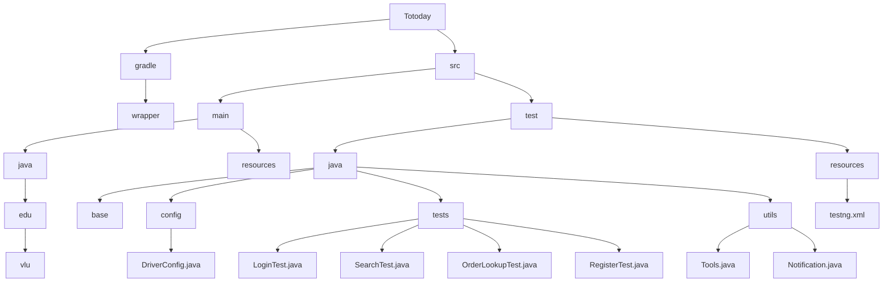

```mermaid
graph TD;
    D[Totoday]
    D --> gradle;
    gradle --> wrapper;
    
    D --> src;
    src --> main;
    main --> java;
    java --> edu;
    edu --> vlu;
    main --> resources;
    
    src --> test;
    test --> java_test["java"];
    java_test --> base;
    java_test --> config;
    config --> DriverConfig.java
    java_test --> tests;
    tests --> LoginTest.java
    tests --> SearchTest.java
    tests --> OrderLookupTest.java
    tests --> RegisterTest.java
    java_test --> utils;
    utils --> Tools.java
    utils --> Notification.java
    test --> resources_test["resources"];
    resources_test --> testng.xml
```
